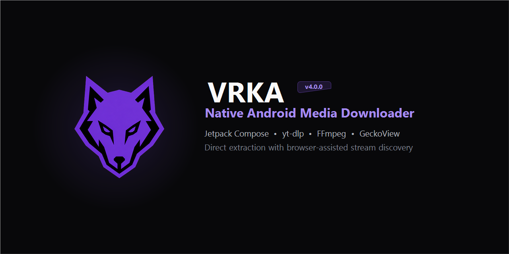
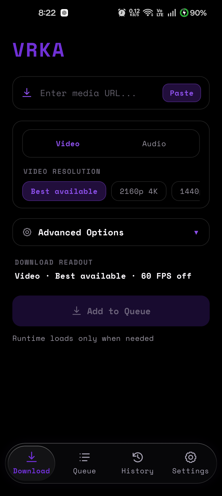
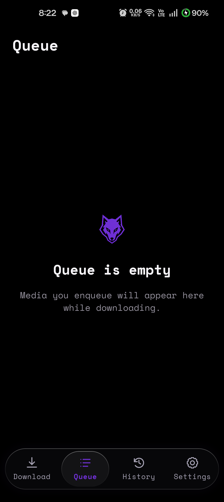
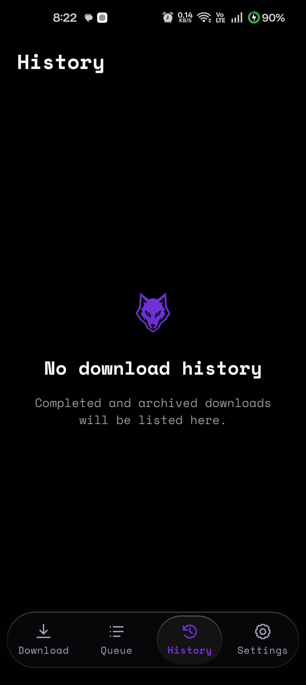
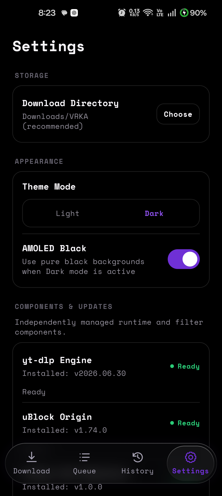
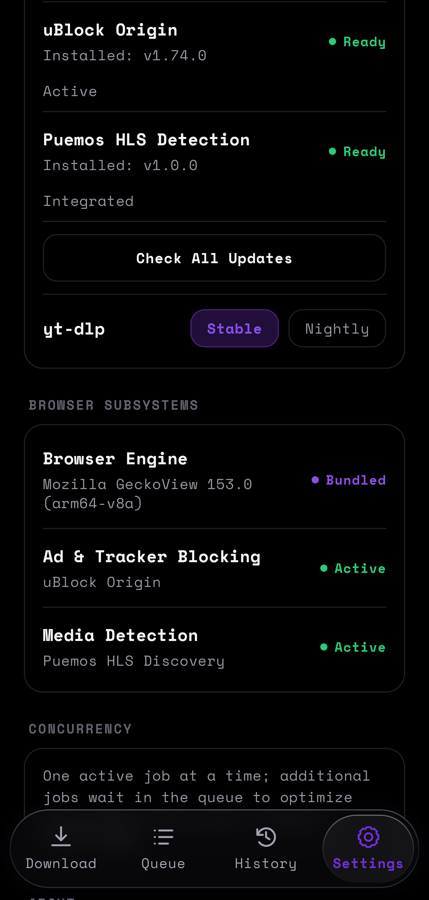
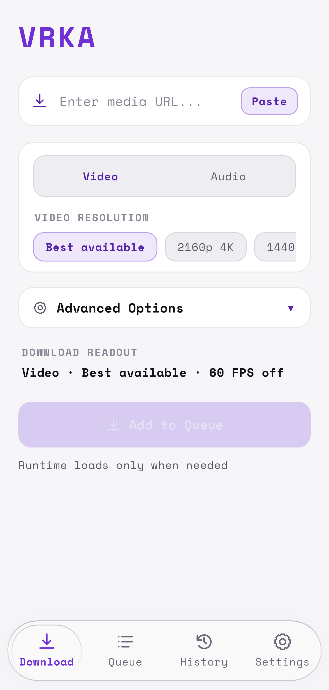

<div align="center">
  
  <h1>VRKA Android</h1>
  <p><strong>Native Android media downloader and passive web stream discovery.</strong></p>

  <p>
    <a href="https://github.com/MaverickRox/VRKA-Android/releases/latest"></a>
    <a href="https://github.com/MaverickRox/VRKA-Android/releases"></a>
    <a href="LICENSE"></a>
    <a href="https://github.com/MaverickRox/VRKA"></a>
    <a href="https://github.com/MaverickRox/VRKA-Android/issues"></a>
  </p>

  <p>
    <a href="https://github.com/MaverickRox/VRKA-Android/releases/latest"><b>Download APK (v4.0.1)</b></a> •
    <a href="#screenshots">Screenshots</a> •
    <a href="#architecture">Architecture</a> •
    <a href="#build-instructions">Build Guide</a> •
    <a href="#release-signing--continuity">Signing Protocol</a> •
    <a href="SECURITY.md">Security</a>
  </p>
</div>

<br />

<div align="center">
  
</div>

---

## Origin

> [!NOTE]
> **Mobile Port**: VRKA Android is the native Android port of the desktop media downloader [**VRKA**](https://github.com/MaverickRox/VRKA) by [MaverickRox](https://github.com/MaverickRox).
>
> - **Desktop Source Repository**: [https://github.com/MaverickRox/VRKA](https://github.com/MaverickRox/VRKA)
> - **Android Port Repository**: [https://github.com/MaverickRox/VRKA-Android](https://github.com/MaverickRox/VRKA-Android)

---

## Overview

**VRKA Android** brings the robust media extraction and passive browser fallback architecture of VRKA Desktop to mobile devices. Built natively with **Jetpack Compose**, **Kotlin Coroutines**, and **Android 16** readiness, it delivers direct media processing powered by `yt-dlp` and `FFmpeg`, combined with an isolated Mozilla **GeckoView** browser fallback engine with integrated **uBlock Origin** content filtering and **Puemos** HLS/DASH packet inspection.

Designed for local, on-device processing with zero telemetry or remote analytics services, featuring an AMOLED-optimized Liquid Glass interface.

---

## Screenshots

<div align="center">
<table>
  <tr>
    <td align="center" width="33%">
      <br />
      <b>Download Interface</b><br />
      <sub>Format, resolution & codec selection</sub>
    </td>
    <td align="center" width="33%">
      <br />
      <b>Task Queue</b><br />
      <sub>Sequential single-flight queue</sub>
    </td>
    <td align="center" width="33%">
      <br />
      <b>Download History</b><br />
      <sub>Archived tasks & media files</sub>
    </td>
  </tr>
  <tr>
    <td align="center" width="33%">
      <br />
      <b>Settings & Runtime</b><br />
      <sub>Component versions & theme toggle</sub>
    </td>
    <td align="center" width="33%">
      <br />
      <b>Browser Subsystems</b><br />
      <sub>Isolated browser runtime, ad filtering & stream detection status</sub>
    </td>
    <td align="center" width="33%">
      <br />
      <b>Light Mode</b><br />
      <sub>Adaptive high-contrast light theme</sub>
    </td>
  </tr>
</table>
</div>

---

## Features

- **Direct Extraction & Download**: Powered by `yt-dlp` and `FFmpeg` (`arm64-v8a`), supporting video/audio stream extraction where provided by the source, resolution selection (Best, 4K, 1440p, 1080p, 720p, etc.), 60 FPS preference, subtitle embedding, and audio extraction (MP3, WAV, FLAC).
- **Background Orchestration**: Resilient foreground `DownloadService` with atomic `JobStore` persistence, notification progress tracking, pause/resume, and sequential queue execution to prevent thermal throttling.
- **Passive Browser Fallback**: An embedded Mozilla `GeckoView` session automatically activates when direct extraction encounters anti-bot challenges or client-side player scripts.
- **Integrated Content Filtering**: Bundled `uBlock Origin` WebExtension filters network requests to suppress intrusive ads and tracking scripts during fallback stream observation.
- **Passive Stream Discovery**: The integrated `Puemos` WebExtension intercepts network traffic to observe and rank media manifests (`.m3u8` playlists, `.mpd` DASH manifests, direct segments).
- **Local On-Device Diagnostics**: Full on-device diagnostic failure logging in Settings with stage attribution, terminal trace viewer, secret-sanitized reporting, and one-tap clipboard export with zero network telemetry.
- **In-App Component Updates**: Manage runtime components (`yt-dlp`) directly in Settings, with Stable and Nightly release channels, rate-limit safeguards, and binary validation.
- **Liquid Glass Design System**: Refined floating capsule navigation with hardware-accelerated `RenderEffect` backdrop blur across AMOLED Black and Light modes.

---

## Architecture

```
┌────────────────────────────────────────────────────────┐
│                   Jetpack Compose UI                   │
│   (HomeScreen, JobsScreen, HistoryScreen, Settings)   │
└──────────────────────────┬─────────────────────────────┘
                           │
┌──────────────────────────▼─────────────────────────────┐
│                 VrkaDownloadManager                    │
│      (Single-flight Queue, State Machine, Events)      │
└────────────┬─────────────────────────────┬─────────────┘
             │                             │
┌────────────▼────────────┐   ┌────────────▼─────────────┐
│      Direct Engine      │   │     Fallback Engine      │
│  (yt-dlp CLI / FFmpeg)  │   │   (GeckoView Runtime)    │
└─────────────────────────┘   └────────────┬─────────────┘
                                           │
                              ┌────────────▼─────────────┐
                              │  GeckoMediaBridge        │
                              │  - uBlock Origin         │
                              │  - Puemos HLS Detector   │
                              │  - Candidate Ranker      │
                              └──────────────────────────┘
```

### Architectural Highlights

1. **UI Layer**: Built strictly with Jetpack Compose and custom tokens (`VrkaTokens`). Features refined Liquid Glass floating navigation with adaptive backdrop blur across AMOLED Dark and Light modes.
2. **Download Pipeline**: Enqueues jobs through a sequential FIFO coordinator. Direct extraction invokes `yt-dlp` directly. If extraction fails, `FailureClassifier` assesses whether the failure is recoverable via browser fallback.
3. **Browser Fallback**: When activated, Mozilla GeckoView boots on-demand in an isolated sandbox. `uBlock Origin` filters unwanted network requests while `Puemos` detects and ranks media streams, extracting necessary cookies and headers for handoff back to the downloader.
4. **Component Management**: Handles background updates for external binaries with rate-limit protection, hash validation, and fallback protection.

---

## Requirements

- **Device Architecture**: `arm64-v8a`
- **Minimum OS**: Android 8.0 (API Level 26)
- **Target OS**: Android 16 (API Level 36)
- **Java Development Kit**: JDK 17 or JDK 21 (e.g., Android Studio JBR)
- **Android SDK**: Build-Tools 36.1+

---

## Build Instructions

### Prerequisites

Set `JAVA_HOME` to your JDK 17+ path:
```powershell
$env:JAVA_HOME = "C:\Program Files\Android\Android Studio\jbr"
```

### Running Offline Unit Tests

```powershell
.\gradlew.bat testDebugUnitTest --offline
```

### Assembling Debug APK

```powershell
.\gradlew.bat assembleDebug --offline
```
Output artifact: `app/build/outputs/apk/debug/app-debug.apk`

### Assembling Release APK

Production release builds require explicit signing credentials. The build system **strictly rejects release builds without credentials** and will never silently fall back to debug signing.

1. Configure your release signing properties (outside Git) in `~/.vrka-android-signing/signing.properties` or via the `VRKA_SIGNING_PROPERTIES` environment variable:

```properties
storeFile=/absolute/path/to/vrka-release.p12
storePassword=YOUR_KEYSTORE_PASSWORD
keyAlias=YOUR_KEY_ALIAS
keyPassword=YOUR_KEY_PASSWORD
```

2. Build the release APK:

```powershell
$env:VRKA_SIGNING_PROPERTIES = "C:\Users\username\.vrka-android-signing\signing.properties"
.\gradlew.bat assembleRelease --offline
```

The compiled release artifact will be located at:
```
app/build/outputs/apk/release/app-release.apk
```

*(Note: Official GitHub release binaries are verified and published as `VRKA-Android-v4.0.1.apk`)*

---

## Release Signing & Continuity (Maintainer Protocol)

To ensure Android system update continuity (`INSTALL_FAILED_UPDATE_INCOMPATIBLE` prevention), every release binary must match the original v1.0 signing lineage:

- **Signer SHA-256 Fingerprint**: `9befdbf4fb00acedb72f866ce4016944c95ea99448e205768383b310ca11e1fa`
- **Signer SHA-1 Fingerprint**: `bb4c93ebc5e2d1eb7d00f8bfad1357da8e5ec9c1`

### Maintainer Verification Steps

1. Verify certificate fingerprint:
   ```bash
   apksigner verify --verbose --print-certs app/build/outputs/apk/release/app-release.apk
   ```
2. Confirm SHA-256 matches `9befdbf4fb00acedb72f866ce4016944c95ea99448e205768383b310ca11e1fa`.
3. Test in-place upgrade on physical hardware:
   ```bash
   adb install -r app/build/outputs/apk/release/app-release.apk
   ```
4. Generate release checksum:
   ```bash
   sha256sum VRKA-Android-v4.0.1.apk > SHA256SUMS
   ```

---

## Installation

1. Download `VRKA-Android-v4.0.1.apk` and `SHA256SUMS` from [GitHub Releases](https://github.com/MaverickRox/VRKA-Android/releases/latest).
2. Verify the SHA-256 hash against `SHA256SUMS`:
   ```powershell
   (Get-FileHash .\VRKA-Android-v4.0.1.apk -Algorithm SHA256).Hash
   ```
3. Install on your Android device:
   ```bash
   adb install -r VRKA-Android-v4.0.1.apk
   ```

---

## Third-Party Notices & Attribution

VRKA Android integrates the following open-source software:
- **yt-dlp**: The Unlicense ([yt-dlp/yt-dlp](https://github.com/yt-dlp/yt-dlp))
- **Mozilla GeckoView**: Mozilla Public License 2.0 ([GeckoView](https://wiki.mozilla.org/Mobile/GeckoView))
- **uBlock Origin**: GNU General Public License v3.0 ([gorhill/uBlock](https://github.com/gorhill/uBlock))
- **Puemos HLS/DASH Detector**: Integrated WebExtension stream sniffing engine
- **FFmpeg**: LGPL / GPL licensed components
- **Space Mono Font**: SIL Open Font License 1.1

---

## License

VRKA Android is free software licensed under the [GNU General Public License v3.0](LICENSE).
See the [LICENSE](LICENSE) file for details.
